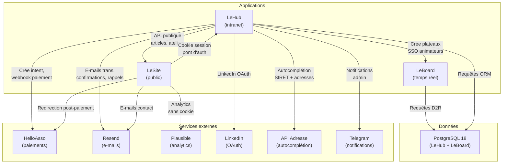

# Le SI de La Fresque Systémique

La Fresque Systémique organise des ateliers de sensibilisation aux enjeux systémiques en présentiel et en ligne. Son système d'information repose sur trois applications web interconnectées qui gèrent ensemble les membres, les ateliers, les inscriptions, les paiements et l'animation en direct. Cette documentation en explore l'architecture, le fonctionnement et les points d'entrée pour un développeur qui doit le reprendre, le debuguer ou le faire évoluer.

## À qui s'adresse cette documentation

Cette documentation vise le transfert de compétences vers un développeur qui reprend le SI de zéro ou qui en maintient une partie. Elle couvre l'architecture des trois applications, leurs échanges, leur modèle de données, les services externes qui les alimentent, et les pièges courants lors du lancement local ou du déploiement.

Elle ne contient délibérément pas : les procédures d'accès au serveur, les chemins d'exploitation, les identifiants de services cloud, les secrets ou variables d'environnement sensibles. Ces informations vivent dans un repo privé distinct appelé LeRunbook, accessible aux admins du projet.

## Les trois applications

| Application | Rôle | Adresse publique | Stack |
|---|---|---|---|
| **LeHub** | L'intranet de l'association et le moteur du SI : membres, ateliers, inscriptions, paiements, contenus, e-mails, badges numériques. C'est la source de vérité pour toute la donnée. | hub.fresquesystemique.org | Next.js 15, PostgreSQL 18 + Prisma 5, NextAuth v5, Resend, HelloAsso |
| **LeSite** | Le site public sur l'apex fresquesystemique.org : découvrir la démarche, consulter l'agenda, s'inscrire, lire les actualités. Pas de base de données propre ; consomme entièrement l'API publique de LeHub. | fresquesystemique.org | Next.js 16, React 19, Leaflet (carte), consomme LeHub API |
| **LeBoard** | Le plateau collaboratif temps réel pour les ateliers en ligne : 283 cartes, post-its, flèches, tout se synchronise en direct entre les participants. Partage la même base que LeHub. | board.fresquesystemique.org | Next.js 16, Socket.io 4, Konva.js, PostgreSQL 18 + Prisma 5 (partagée) |

## Qui parle à qui

## Par où commencer

Trois parcours de lecture selon votre besoin :

**Je reprends le SI de zéro.** Commencez par cette page, puis explorez chacune des trois applications en suivant le même parcours : fonctionnalités, stack technique, modèle de données, lancement en local, déploiement. Les noms des applications (LeHub, LeSite, LeBoard) ne sont pas encore des liens cliquables (ils seront activés après la tâche 6 de rédaction).

**Je dois corriger un bug sur une application.** Allez directement à la section correspondante (LeHub, LeSite ou LeBoard), lisez son modèle de données pour localiser le bug, puis consultez sa page « Lancement en local » pour reproduire le problème et tester votre correction.

**Je dois opérer la production.** Consultez le LeRunbook, le repo privé qui détaille les procédures d'accès au serveur, les scripts de sauvegarde, les alertes de monitoring et les rollback d'urgence. Ce qui suit est de la documentation de code, pas d'exploitation.

<!-- liens ajoutés en tâche 6 -->
