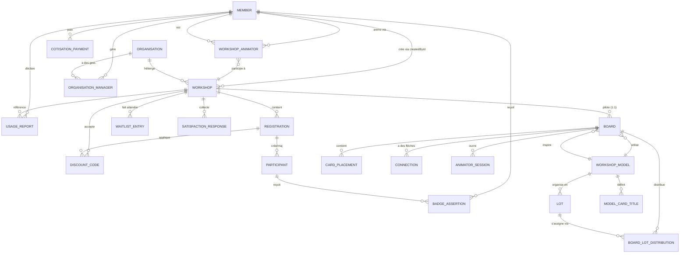

# Modèle de données

Le schéma Prisma (`prisma/schema.prisma`) est la source unique de vérité pour le modèle de données. Cette page détaille les 30+ modèles centraux. Le schéma utilise PostgreSQL 18 et Prisma 5 avec soft delete sur certaines entités (`deletedAt`).

## Modèles métier

### Member

Représente un adhérent, animateur ou formateur de l'association.

| Champ | Type | Rôle |
|---|---|---|
| `id` | String (CUID) | Identifiant unique |
| `email` | String (unique) | Email de connexion |
| `firstName`, `lastName` | String | Identité |
| `passwordHash` | String? | Hash bcrypt (credentials auth) |
| `gender` | String | "masculin" / "feminin" / "neutre" (défaut) — appliqué aux templates emails |
| `role` | String | "adherent" (défaut) / "animateur" / "formateur" — rôle pédagogique |
| `isAdmin` | Boolean | Accès espace admin (`false` défaut) — **indépendant** du `role` |
| `habilitationAnimation` | String? | "grand_public" / "professionnelle" / null |
| `habilitationFormation` | String? | "grand_public" / "professionnelle" / null |
| `habilitationExpiry` | DateTime? | Date d'expiration habilitations |
| `linkedinId` | String? (unique) | ID LinkedIn OAuth |
| `linkedinUrl`, `websiteUrl` | String? | URLs profil |
| `avatarUrl` | String? | URL avatar custom (fallback Gravatar) |
| `bio`, `tagline` | String? | Bio et phrase d'accroche « En une ligne » |
| `location` | String? | Localisation |
| `phone` | String? | Téléphone |
| `badges` | String[] | IDs badges obtenus (dénormalisé pour perf) |
| `directoryConsent` | Boolean | Opt-in annuaire public |
| `cotisationStatus` | String | "inactive" (défaut) / "active" / "expired" — synchro HelloAsso webhook |
| `cotisationExpiry` | DateTime? | Date expiration cotisation |
| `licenceType` | String? | "professionnelle" / "citoyenne" / "interne" — "interne" exempt cotisation |
| `invitationToken` | String? (unique) | Token invitation pour nouveaux membres |
| `passwordResetToken` | String? (unique) | Token reset password (avec expiry) |
| `createdAt`, `updatedAt`, `deletedAt` | DateTime | Timestamps (soft delete) |

**Relations** : crée des `Workshop`, anime via `WorkshopAnimator`, rapports via `UsageReport`, badges via `BadgeAssertion`, gest. organisations via `OrganisationManager`, cotisations via `CotisationPayment`.

### Workshop

Représente un atelier ou formation (public ou privé, grand public ou inter-organisations).

| Champ | Type | Rôle |
|---|---|---|
| `id` | String (CUID) | Identifiant unique |
| `slug` | String (unique) | Slug URL publique |
| `title`, `description` | String | Titre et description |
| `date` | DateTime | Date/heure de début |
| `duration` | Int | Durée en minutes |
| `eventType` | String | "atelier" (défaut) / "formation" |
| `type` | String | Type atelier technique (ex: "game", "discussion") |
| `format` | String | Format (ex: "en_ligne", "presentiel", "hybride") |
| `timezone` | String | Timezone ("Europe/Paris" défaut) |
| `language` | String | "fr" (défaut) |
| `location`, `address`, `city`, `postalCode`, `region`, `department` | String? | Adresse (autocompletée BAN) |
| `theme` | String? | Thème |
| `targetPublic` | String | "grand_public" (défaut) / "inter_organisations" |
| `context` | String? | Contexte additionnel |
| `capacity` | Int | Nombre de places |
| `price`, `priceSolidaireHT`, `priceClassiqueHT`, `priceSoutienHT` | Float | Prix TTC et HT par tier (personnalisés par atelier) |
| `status` | String | "draft" (défaut) / "published" / "cancelled" |
| `createdById` | String? | Animateur créateur (relation `Member`) |
| `organisationId` | String? | Rattachement organisation (inter-organisations) |
| `modelId` | String? | ID modèle plateau si atelier en ligne |
| `waitlistEnabled` | Boolean | Liste d'attente active |
| `privateRegistrationEnabled` | Boolean | Inscriptions privées (invités seuls) |
| `createdAt`, `updatedAt`, `deletedAt` | DateTime | Timestamps (soft delete) |

**Relations** : `createdBy` (Member), `organisation` (Organisation), animateurs via `WorkshopAnimator`, inscriptions via `Registration`, liste d'attente via `WaitlistEntry`, plateau via `Board`, résultats satisfaction via `SatisfactionResponse`, rapports utilisation via `UsageReport`, codes avantage via `DiscountCode`.

### Registration

Représente l'inscription d'un participant à un atelier.

| Champ | Type | Rôle |
|---|---|---|
| `id` | String (CUID) | Identifiant unique |
| `workshopId`, `workshop` | String + FK | Atelier |
| `firstName`, `lastName`, `email`, `phone` | String | Données participant |
| `paymentStatus` | String | "pending" (défaut) / "paid" / "refunded" / "voucher" / "blocked" |
| `helloassoCheckoutIntentId` | String? | ID intention de paiement HelloAsso |
| `helloassoOrderId` | String? | ID ordre HelloAsso (webhook) |
| `amountHT`, `amountTTC`, `vatAmount` | Float | Montants facturés |
| `discountCodeId` | String? | Code avantage appliqué |
| `discountAmountHT` | Float | Réduction appliquée |
| `invoiceUrl` | String? | URL facture PDF |
| `attended` | Boolean? | Présence pointée |
| `participantId` | String? | Lien CRM `Participant` (créé/mis à jour au webhook) |
| `cancellationToken` | String? (unique) | Token d'annulation public (lien email) |
| `cancelledAt` | DateTime? | Date annulation |
| `refundMethod` | String? | "refund" / "voucher" / "blocked" — décision remboursement |
| `surveyToken` | String? (unique) | Token questionnaire satisfaction |
| `surveySentAt`, `surveyRespondedAt` | DateTime? | Envoi et réponse satisfaction |
| `reminderSentAt` | DateTime? | Rappel J-2 envoyé |
| `createdAt`, `updatedAt` | DateTime | Timestamps |
| **Unique** | `[workshopId, email]` | Une seule inscription par email par atelier |

**Relations** : workshop, participant (CRM), code avantage.

### Participant

Représente un participant dans le CRM (déduplication par email).

| Champ | Type | Rôle |
|---|---|---|
| `id` | String (CUID) | Identifiant unique |
| `email` | String (unique) | Email de déduplication |
| `firstName`, `lastName`, `phone` | String | Données contact |
| `tags` | String[] | Étiquettes texte libre (admin) |
| `notes` | String? | Notes internes admin |
| `firstSeenAt` | DateTime | Première inscription enregistrée |
| `createdAt`, `updatedAt`, `deletedAt` | DateTime | Timestamps (soft delete) |

**Relations** : inscriptions via `Registration`, badges via `BadgeAssertion`.

### WorkshopAnimator

Liaison N-N atelier ↔ animateur avec rôle (lead/co) et tracking « nouveaux inscrits ».

| Champ | Type | Rôle |
|---|---|---|
| `id` | String (CUID) | Identifiant unique |
| `workshopId` | String | Atelier |
| `memberId` | String | Animateur |
| `role` | String | "lead" / "co" — lead = responsable |
| `lastViewedAt` | DateTime | Timestamp dernière visite fiche atelier → déclenche le badge "nouveaux inscrits" |
| **Unique** | `[workshopId, memberId]` | Un seul rôle par animateur par atelier |

### Organisation

Fiches organisation pour ateliers inter-organisations (lookup SIRET auto).

| Champ | Type | Rôle |
|---|---|---|
| `id` | String (CUID) | Identifiant unique |
| `name` | String (unique) | Nom organisation |
| `type` | String? | Type (entreprise, association, etc.) |
| `siret` | String? (unique) | SIRET (lookup API recherche-entreprises) |
| `address`, `city`, `postalCode` | String? | Adresse |
| `notes` | String? | Notes internes |
| `createdAt`, `updatedAt` | DateTime | Timestamps |

**Relations** : ateliers via `Workshop`, gestionnaires via `OrganisationManager`.

### OrganisationManager

Liaison N-N organisation ↔ membre (gestionnaire).

| Champ | Type | Rôle |
|---|---|---|
| `id` | String (CUID) | Identifiant unique |
| `organisationId`, `memberId` | String | Organisation et gestionnaire |
| `createdAt` | DateTime | Timestamp |
| **Unique** | `[organisationId, memberId]` | Un seul rôle gestionnaire par membre par org |

### WaitlistEntry

Liste d'attente pour ateliers complets.

| Champ | Type | Rôle |
|---|---|---|
| `id` | String (CUID) | Identifiant unique |
| `workshopId`, `workshop` | String + FK | Atelier |
| `firstName`, `lastName`, `email`, `phone` | String | Données |
| `position` | Int | Position dans la file |
| `notifiedAt` | DateTime? | Notification d'ouverture de place |
| `createdAt` | DateTime | Timestamp |
| **Unique** | `[workshopId, email]` | Une seule entrée par email par atelier |

### CotisationPayment

Paiements de cotisation tracés (source HelloAsso).

| Champ | Type | Rôle |
|---|---|---|
| `id` | String (CUID) | Identifiant unique |
| `memberId`, `member` | String + FK | Adhérent |
| `helloassoOrderId` | String (unique) | ID ordre HelloAsso |
| `licenceType` | String | Licence achetée (professionnelle / citoyenne / interne) |
| `amountCents` | Int | Montant en centimes |
| `paidAt` | DateTime | Date paiement |
| `createdAt` | DateTime | Timestamp |

### BadgeAssertion

Badges Open Badges 3.0 (VerifiableCredential JWT signé EdDSA).

| Champ | Type | Rôle |
|---|---|---|
| `id` | String (CUID) | Identifiant unique |
| `type` | String | "ANIMATOR_PUBLIC" / "ANIMATOR_PRO" / "TRAINER_PUBLIC" / "TRAINER_PRO" / "PARTICIPANT" |
| `memberId`, `participantId` | String? | Bénéficiaire (Member ou Participant) |
| `recipientEmail`, `recipientName` | String | Données pour assertion |
| `signedJwt` | String (Text) | JWT EdDSA signé (VerifiableCredential OB3) |
| `issuedAt` | DateTime | Date émission |
| `revoked` | Boolean | Révocation |
| `createdAt` | DateTime | Timestamp |

### UsageReport

Déclarations de droits d'utilisation professionnels (rapports pédagogiques).

| Champ | Type | Rôle |
|---|---|---|
| `id` | String (CUID) | Identifiant unique |
| `memberId`, `workshopId` | String | Animateur et atelier référence |
| `usageContext`, `organisationName`, `participantCount` | String | Contexte d'utilisation |
| `amountHT`, `amountTTC` | Float | Montants facturés |
| `paymentStatus` | String | "pending" / "paid" |
| `helloassoCheckoutIntentId`, `helloassoOrderId` | String? | Traçabilité paiement HelloAsso |
| `invoiceUrl` | String? | URL facture |
| `createdAt`, `updatedAt` | DateTime | Timestamps |

### Article

Actualités du Hub (publiées sur LeSite).

| Champ | Type | Rôle |
|---|---|---|
| `id` | String (CUID) | Identifiant unique |
| `slug` | String (unique) | Slug URL |
| `title`, `excerpt`, `body` | String | Contenu Markdown GFM |
| `category` | String | Catégorie article |
| `authorName`, `authorRole` | String | Auteur (dropdown admin) |
| `imageUrl`, `imageCaption` | String? | Image et légende (upload → WebP) |
| `published` | Boolean | Publication |
| `publishedAt` | DateTime? | Date publication |
| `wordCount` | Int | Nombre de mots |
| `createdAt`, `updatedAt` | DateTime | Timestamps |

### Resource

Médiathèque (articles, livres, podcasts, vidéos, rapports).

| Champ | Type | Rôle |
|---|---|---|
| `id` | String (CUID) | Identifiant unique |
| `title`, `description` | String | Titre et description |
| `type` | String? | Type (article, book, podcast, video, report) |
| `themes` | String[] | Thématiques (multi-select) |
| `category` | String | "documentaire" (défaut) |
| `workshopType` | String? | Type atelier associé |
| `authors` | String[] | Auteurs |
| `date` | DateTime? | Date publication |
| `languageLinks`, `titleLinks` | Json | Traductions et liens par langue |
| `isPublic` | Boolean | Visibilité |
| `createdAt` | DateTime | Timestamp |

### PedagogicalVersion

Supports pédagogiques versionnés (section + slot, accès animateur/formateur).

| Champ | Type | Rôle |
|---|---|---|
| `id` | String (CUID) | Identifiant unique |
| `section`, `slot` | String | Section et slot (ex: "formation", "1") |
| `version` | String | Version (ex: "v1.0") |
| `link` | String | URL ressource |
| `date` | DateTime? | Date version |
| `access` | String | "animateur" (défaut) / "formateur" |
| `isCurrent` | Boolean | Version courante |
| `notes` | String? | Notes |
| `createdAt` | DateTime | Timestamp |

### DiscountCode

Codes avantage (réduction % ou montant fixe).

| Champ | Type | Rôle |
|---|---|---|
| `id` | String (CUID) | Identifiant unique |
| `code` | String (unique) | Code (ex: "NOEL20") |
| `percentOff`, `amountOffTTC` | Int/Float? | Réduction (l'une ou l'autre) |
| `maxUses` | Int? | Limite d'utilisations |
| `workshopId` | String? | Restriction à un atelier (optionnel) |
| `restrictedToEmail` | String? | Restriction email (optionnel) |
| `expiresAt` | DateTime? | Expiration |
| `active` | Boolean | Activité |
| `createdAt`, `updatedAt` | DateTime | Timestamps |

### SatisfactionResponse

Réponses au questionnaire post-atelier.

| Champ | Type | Rôle |
|---|---|---|
| `id` | String (CUID) | Identifiant unique |
| `workshopId`, `workshop` | String + FK | Atelier |
| `answers` | Json | Réponses structurées (JSON) |
| `comment` | String? | Commentaire libre |
| `submittedAt` | DateTime | Date réponse |

### Settings

Paramètres globaux (singleton, `id='global'`).

| Champ | Type | Rôle |
|---|---|---|
| `id` | String | "global" (unique) |
| `workshopModerationOn` | Boolean | Flag modération ateliers |
| `siteChantierMode` | Boolean | Mode chantier site public |
| `priceInterneHT`, `pricePrestationHT`, `vatRate` | Float | Tarifications legacy |
| `priceSolidaireHT`, `priceClassiqueHT`, `priceSoutienHT` | Float | Prix par défaut (legacy, overridable par `PricingPolicy`) |
| **Identité** | `associationName`, `logoPath`, `address`, `postalCode`, `city`, `contactEmail` | Infos association |
| **Mentions légales** | `siret`, `rna`, `tvaNumber`, `tvaApplicable` | Données légales |
| **Email** | `emailFrom`, `emailFromName`, `emailReplyTo`, `resendApiKey` | Config Resend |
| **HelloAsso** | `helloassoClientId`, `helloassoClientSecret`, `helloassoOrgSlug`, `helloassoEnv` | Identifiants HelloAsso (prod) |
| | `helloassoSandboxClientId`, `helloassoSandboxClientSecret`, `helloassoSandboxOrgSlug` | Identifiants HelloAsso (sandbox) |
| | `helloassoRefundEnabled` | Remboursement HelloAsso auto (en attente privilège `RefundManagement`) |
| **Telegram** | `telegramBotToken`, `telegramChatId` | Notifs admin |
| **Logo.dev** | `logoDevPublishableKey`, `logoDevSecretKey` | API Logo.dev (signatures digitales optionnel) |
| `emailsEnabled` | Json? | Toggle activation/désactivation des templates emails |
| `updatedAt` | DateTime | Timestamp |

### PricingPolicy

Tarification par `eventType × publicType` (matrice 3-tiers).

| Champ | Type | Rôle |
|---|---|---|
| `id` | String (CUID) | Identifiant unique |
| `eventType`, `publicType` | String | Clés (ex: "atelier", "grand_public") |
| `solidaireHT`, `classiqueHT`, `soutienHT` | Float | Prix par tier |
| **Unique** | `[eventType, publicType]` | Une seule politique par combinaison |

### FormatPricing

Prix hors taxes par format d'atelier. Table d'appoint très simple, distincte de `PricingPolicy` : là où `PricingPolicy` croise un type d'événement et un type de public pour produire trois tarifs, `FormatPricing` associe un prix unique à un format.

| Champ | Type | Rôle |
|---|---|---|
| `id` | String (CUID) | Identifiant unique |
| `format` | String | Format d'atelier, unique |
| `priceHT` | Float | Prix hors taxes pour ce format |

**Relations** : aucune. La table est lue par clé `format`.

### NotificationConfig

Configuration notifications email/Telegram par type d'événement admin.

| Champ | Type | Rôle |
|---|---|---|
| `id` | String (CUID) | Identifiant unique |
| `eventType` | String (unique) | Type événement (ex: "rapport_utilisation") |
| `emailEnabled`, `telegramEnabled` | Boolean | Canaux actifs |

### PendingLink

Liaisons OAuth LinkedIn en attente (TTL 15 min).

| Champ | Type | Rôle |
|---|---|---|
| `id` | String (CUID) | Identifiant unique |
| `token` | String (unique) | Token lien |
| `linkedinId`, `linkedinName`, `linkedinEmail` | String | Données LinkedIn |
| `expiresAt` | DateTime | Expiration |
| `createdAt` | DateTime | Timestamp |

### WorkshopModel

Modèles de plateau LeBoard.

| Champ | Type | Rôle |
|---|---|---|
| `id` | String (CUID) | Identifiant unique |
| `name` | String | Nom modèle |
| `language` | String | "fr" (défaut) |
| `plateauId` | String? | ID plateau LeBoard (ref) |
| `createdAt`, `updatedAt` | DateTime | Timestamps |

**Relations** : lots via `Lot`, boards via `Board`, titres cartes via `ModelCardTitle`.

### Lot

Lots de cartes d'un modèle plateau.

| Champ | Type | Rôle |
|---|---|---|
| `id` | String (CUID) | Identifiant unique |
| `modelId`, `model` | String + FK | Modèle |
| `name` | String | Nom lot |
| `order` | Int | Ordre |
| `stageId` | String? | ID étape LeBoard |
| `kind` | String? | Type lot |
| `cardIds` | String | IDs cartes (JSON ou CSV) |
| `contentType` | String | "cards" (défaut) / "slides" |
| `slidesData` | String? | Données diapositives |

**Relations** : distributions via `BoardLotDistribution`.

### Board

Plateau en ligne d'un atelier (propriété LeBoard, accès en écriture du Hub).

| Champ | Type | Rôle |
|---|---|---|
| `id` | String (CUID) | Identifiant unique |
| `workshopId` | String (unique) | Atelier |
| `workshopTitle` | String | Titre (dénormalisé) |
| `token` | String (unique) | Token d'accès |
| `language` | String | "fr" (défaut) |
| `status` | String | "active" (défaut) |
| `isTraining` | Boolean | Atelier test (24h expiration) |
| `expiresAt` | DateTime? | Expiration |
| `modelId` | String? | Modèle plateau |
| `activeStageId` | String | ID étape active (persisté pour redémarrage) |
| `createdAt`, `updatedAt` | DateTime | Timestamps |

**Relations** : placements via `CardPlacement`, connexions via `Connection`, distributions via `BoardLotDistribution`, sessions via `AnimatorSession`.

### CardPlacement

Positionnement d'une carte sur un plateau.

| Champ | Type | Rôle |
|---|---|---|
| `id` | String (CUID) | Identifiant unique |
| `boardId`, `cardId` | String | Plateau et ID carte |
| `x`, `y` | Float | Coordonnées |
| `rotation` | Float | Rotation en degrés |
| `zIndex` | Int | Profondeur |
| `flipped` | Boolean | Verso retourné |
| `updatedAt` | DateTime | Timestamp |

### Connection

Flèche/connexion entre cartes sur un plateau.

| Champ | Type | Rôle |
|---|---|---|
| `id` | String (CUID) | Identifiant unique |
| `boardId` | String | Plateau |
| `fromId`, `toId` | String | Cartes source/destination |
| `label` | String? | Label flèche |
| `createdAt` | DateTime | Timestamp |

### AnimatorSession

Sessions SSO animateur (token signé, TTL).

| Champ | Type | Rôle |
|---|---|---|
| `id` | String (CUID) | Identifiant unique |
| `boardId`, `memberId` | String | Plateau et animateur |
| `pseudo` | String | Pseudonyme animateur |
| `expiresAt` | DateTime | Expiration session |
| `createdAt` | DateTime | Timestamp |

### ModelCardTitle

Titres de cartes personnalisés par modèle.

| Champ | Type | Rôle |
|---|---|---|
| `id` | String (CUID) | Identifiant unique |
| `workshopModelId`, `cardId` | String | Modèle et ID carte |
| `customTitle` | String | Titre personnalisé |
| **Unique** | `[workshopModelId, cardId]` | Un seul titre par carte par modèle |

### BoardLotDistribution

Distribution des lots sur un plateau (timestamp + mode de lancement).

| Champ | Type | Rôle |
|---|---|---|
| `id` | String (CUID) | Identifiant unique |
| `boardId`, `lotId` | String | Plateau et lot |
| `mode` | String | "distribute" (défaut) / "popcorn" |
| `distributedAt` | DateTime | Timestamp distribution |
| **Unique** | `[boardId, lotId]` | Un seul record par lot par plateau |

### CardMeta

Titres de cartes personnalisés legacy (hors modèle).

| Champ | Type | Rôle |
|---|---|---|
| `id` | String (CUID) | Identifiant unique |
| `cardId` | String | ID carte |
| `language` | String | Langue |
| `customTitle` | String? | Titre personnalisé |
| **Unique** | `[cardId, language]` | Un seul titre par carte par langue |

## Diagramme ER (flux principaux)

